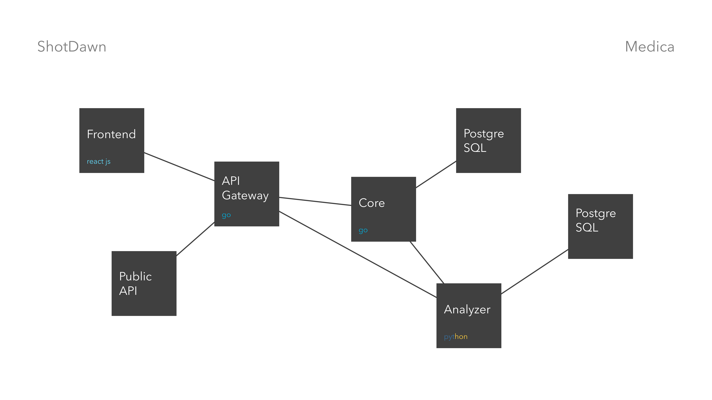

# Medica

Electronic assistant to the head of a medical institution

### Architecture

Frontend, API Gateway, Core, Analizer microservices

### REST API

The REST API to the example app is described below.

### For content visit

* localhost:8080/

### Run the app

    $ docker compose up --build -d

### Swagger

* http://localhost:9000/swagger/index.html

### Team

shotdawn

1. Danila Artamonov (Backend, MISIS)
2. Tani Suksina (Backend, MISIS)
3. Konstantin Zorin (Data Scientist, MISIS)
4. Vsevolod (Frontend)
5. Yana (UX/UI)
